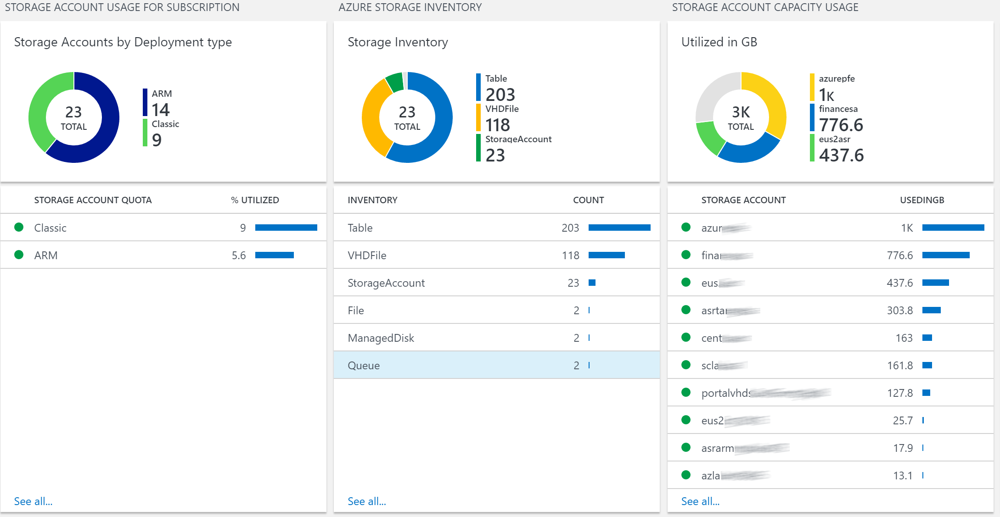
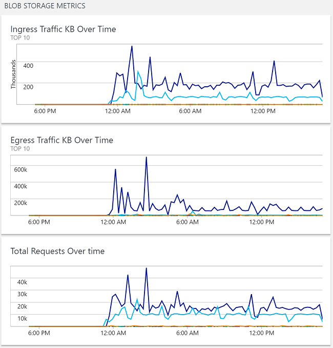

# Azure Storage Analytics

 

>[AZURE.NOTE]This is preliminary documentation for Azure Storage Analytics, a management solution you can deploy into OMS that will provide insights and analytics of your storage accounts. The solution is currently in preview. 

 Microsoft Azure Storage is the cloud storage solution for modern applications that rely on durability, availability, and scalability to meet the needs of their customers. Azure storage provides  Blob storage, Table storage, Queue storage, and File storage services.
Azure Storage Analytics Solution collects and visualizes inventory information, capacity metrics, transaction metrics and storage errors for storage accounts in an Azure subscription. Users can easily create additional rules to monitor storage resources. This solution leverages Azure Automation, the Log Analytics Ingestion API, together with Log Analytics views to present data about all your storage accounts  in a single  workspace. 

## Pre-reqs

- **Automation Account with SPN**

Before you deploy this template, you must create an Automation Account in the Azure portal with the default settings so that the SPN account will be created. If you have an existing OMS Log Analytics Workspace you would like to use for this solution, it is important that the Automation account is created into the **same Resource Group where the OMS Log Analytics Workspace is located**.

If you **dont** have an existing OMS Log Analytics Workspace, the template will create and deploy this for you.

## Deploying the Azure Storage Analytics Solution

### Follow these instructions to deploy the solution into an existing - or new Log Analytics Workspace

Log into Azure Portal (https://portal.azure.com) and ensure you are in the subscription containing the recovery vault you want to monitor

Locate your existing OMS Log Analytics Workspace and note the name of the workspace, the location of the workspace, and the Resource Group

 

Next, create a new Automation Account and click on *New* and search for 'Automation'

 
Select Automation and click *Create* 

Specify the name of the Automation Account and ensure you are selecting 'Use existing' and selects the Resource Group containing the OMS Log Analytics workspace. If possible, use the same Azure Region for the Automation Account. Ensure that 'Create Azure Run As account' is set to 'Yes' and click 'Create'

Once the deployment has completed, you should see the Automation account and the Log Analytics workspace in the same Resource Group

###You can now deploy the template   
 

This will send you to the Azure Portal with some default values for the template parameters. 
Ensure that the parameters reflects your setup so that you are deploying this into the *existing* Resource Group containing the Log Analytics Workspace and the Automation account.

#### Parameters

* OMS Log Analytics Workspace Name

Specify the name of the workspace you want to deploy this solution to

* OMS Log Analytics Region

Select the Azure Region where your existing workspace is located

* OMS Automation Account Name

Specify the name of the automation account you created earlier

* OMS Automation Region

Select the Azure Region where your automation account is located

You should also change the values for the *Asr Ingest Schedule Guid* and *Ab Ingest Schedule Guid*. You can generate your own using PowerShell with the following cmdlet:

Once you have customized all the parameters, click *Create*

The ingestion will start 5-10 minutes post deployment.

## Exploring the views

Once the template has successfully been deployed,  storage account inventory data ingestion should occur within 15 minutes post deployment. Metrics data requires  storage analytics minute metrics , which will be automatically  enabled  after solution is deployed. As a result, initial metrics collection might take up to 60 mins to ingest into the workspace.  If you are deploying the solution to a new workspace, it can take approximately 30 minutes before the indexing has completed for the workspace in general. 

In the Resource Group where you deployed the template, you should see the solution resource.

* AzureStorageAnalytics[workspaceName]

### Azure Storage Analytics 

The views for Azure Storage Analytics  will give you an overview of all the storage accounts  within your Azure Subscription. 

 Solution collects and visualizes ;
**Inventory Data**
	*Storage accounts
	* File Shares
	* Queues
	* Tables 
	* VHD files 
	* Managed disks for virtual machines. 
**Capacity Metrics**
* UtilizedGB
* Container Count
* Object Count
**Transaction Metrics** 
* Availability
* Total Requests , 
* Ingress KB
* Egress KB
* PercentSuccess
* PercentErrors 
* AverageE2E Latency
* Average Server Latency
**File Shares** 
*Quota 
*Usage 
**Subscription Level Storage Quota Usage**
* ARM based quota usage
* Classic quota usage 

Solution also includes 14 preconfigured alerts  which can be used to notify for when certain thresholds are reached.  You can view the alerts and modify thresholds  from Alerts under workspace settings .

